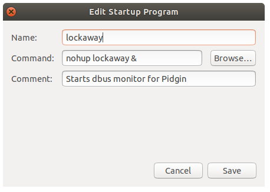

# Lockaway

Uses dbus to read the current status from X11 in order to automatically set a custom status for Pidgin when locking and unlocking computer.

## Usage

#### Recommended

Make sure the script is in your `$PATH` then add it to Startup Applications or call from `.bashrc`

<p align='center'>
  
</p>

#### Start manually

```bash
nohup ./lockaway.sh &
```

## Compatibility

Ubuntu 14.04 +

- < 14.04 needs `interface='org.gnome.ScreenSaver'` in the dbus call.

  Tested on Ubuntu only but should work on other distros running X11.
